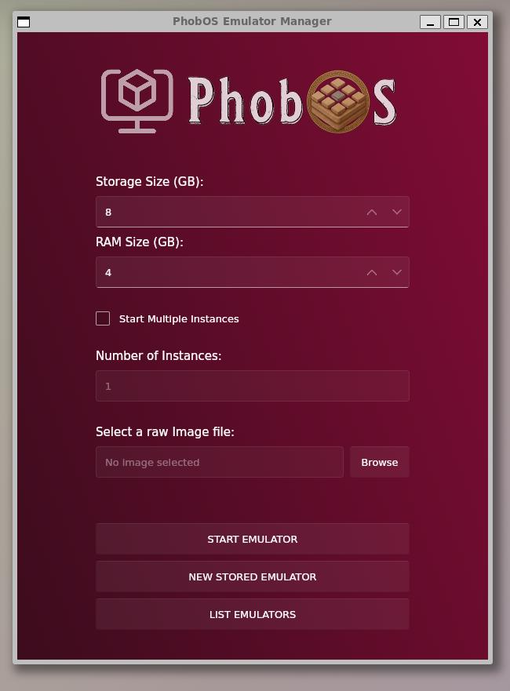

# PhobOS Emulator Manager



The PhobOS Emulator Manager is a graphical user interface that allows you to configure resources and run virtual machines that run PhobOS. The PhobOS Emulator Manager is based on the QEMU emulator and runs inside a Docker container with the necessary dependencies and leveraging the Docker bridge network to communicate with the external world.

## Installation

> [!WARNING]
> The PhobOS Emulator Manager depends on Docker. Make sure you have Docker installed on your host machine before running the PhobOS Emulator Manager.

To install the PhobOS Emulator Manager, you can run the following command:

```bash
wget -qO- https://github.com/gaiaBuildSystem/phobosEmulatorManager/releases/latest/download/install.sh  | bash
```

The installation script will download the latest version of the PhobOS Emulator Manager and add a symbolic link to your system `bin` directory. After the installation, you can run the PhobOS Emulator Manager by typing `phobos-emulator-manager` in your terminal.

## Running Multiple Instances

To test fleet of devices, you can run multiple instances of the PhobOS. Check the `Start Multiple Instances` checkbox and set the number of instances you want to run.

> [!WARNING]
> Running multiple instances may require a lot of resources from your host machine. Make sure you have enough resources available. The manager will allocate the same amount of resources configured in the `Storage Size` and `RAM Size`fields for each instance.

## Running a local PhobOS image

PhobOS emulator manager uses images that comes embedded in the container image by default. If you want to run a local PhobOS image, you can do so by specifying the absolute path to the image as argument for the command `phobos-emulator-manager`. For example:

```bash
phobos-emulator-manager /path/to/your/phobos-image.img
```
